# 量子六爻（Qliuyao）架构评审报告

> 评审类型：**只读架构评审**，未修改任何源码。
> 评审范围：Python CLI 端（`/`）与 Web 端（`/web`）。
> 方法：Read / Grep / Glob + 只读验证脚本（脚本落于 `/tmp`，未触碰项目目录）。
> 评审日期：2026-09-04

---

## 1. TL;DR

- 整体健康度：**良（领域算法正确、双端数据零漂移）**，但**工程纪律与安全存在明确缺口**。
- 最关键 3 个问题：
  1. **`P1` 密钥泄露**：`.env` 含真实格式 DeepSeek key（`sk-...`）并被 git 跟踪，`release.sh` 还主动公开到 GitHub（`.env:3` / `release.sh:39-46` / `.gitignore` 故意不忽略）。
  2. **`P1` 模型名三处不一致**：Python `deepseek-v4-pro` / Web `deepseek-chat` / compose `deepseek-v4-pro-0813`，Python 默认值疑似无效模型，可能运行时报错（`ai_interpreter.py:35` / `route.ts:7` / `docker-compose.yml:15`）。
  3. **`P2` 双端领域逻辑双份实现** + **CLAUDE.md 工作流基本未落地**（无 Playwright、main 直接提交绕过 dev）。当前卦数据经程序化校验**零漂移**，但 prompt 与模型已漂移，长期风险高。
- 领域算法核心（起爻映射 / 64 卦索引 / 互错综 / 当位应承 / 朱子断卦）：**双端一致且数学正确**，无功能性 P0。

---

## 2. 架构总览

```mermaid
flowchart TB
  subgraph Py["Python CLI 端 (/, 本地/服务器)"]
    M["main.py: 交互流程/调度"]
    L["liuyao.py: 量子电路( pyqpanda3 )+起爻"]
    G["gua_analysis.py: 互/错/综 + 当位应承乘"]
    H["hexagrams.py + hexagram_wings.py + trigrams.py: 64卦数据"]
    A["ai_interpreter.py: DeepSeek 解卦( urllib , 零依赖)"]
    M --> L --> G --> H --> A
  end

  subgraph Web["Web 端 (/web, Next.js15 App Router + Vercel Edge)"]
    PG["page.tsx / quantum / index-64 / about / disclaimer"]
    DIV["api/divine/route.ts (Edge): 起卦+衍生卦"]
    INT["api/interpret/route.ts (Edge): SSE 转发 DeepSeek"]
    Q["lib/quantum.ts: 电路模拟器( crypto.getRandomValues )"]
    AN["lib/analysis.ts: 互/错/综+当位应承乘"]
    HJ["lib/hexagrams.ts + hexagrams.json: 64卦数据"]
    PT["lib/prompt.ts: 解卦 prompt"]
    DIV --> Q --> AN --> HJ
    INT --> PT
  end

  Deep["DeepSeek API (外部)"]
  A --> Deep
  INT --> Deep

  style Py fill:#1e293b,stroke:#475569
  style Web fill:#1e293b,stroke:#475569
```

**调用链要点**
- 起卦：Python 用 `pyqpanda3` CPU 虚拟机（真量子态向量，PRNG 采样）；Web 用 `crypto.getRandomValues` + 拒绝采样，数学等价。**Edge 无法装 pyqpanda3，必须各自实现 simulator**（这是合理的约束，非设计缺陷）。
- 解卦：两端都把"卦象档案 + 朱子断法"拼进 prompt 再调 DeepSeek；Web 多一层 SSE 流式转发（Edge Runtime）。
- 数据：64 卦数据两端各存一份（`hexagrams.py` 805 行 与 `hexagrams.json`），**本次校验两者二进制→卦名/卦序完全一致（0 漂移）**。

---

## 3. 问题清单

| 严重度 | 问题 | 证据（文件:行 / 命令） | 影响 | 建议修复方向 |
|---|---|---|---|---|
| P1 | 密钥被提交进 git 且主动公开 | `git ls-files`→`.env`；`.env:3`（真实格式 `sk-...`）；`.gitignore:19-22` 故意不忽略；`release.sh:39-46` | 密钥永久留在 git 历史，GitHub 爬虫可拾取，构成凭据泄露面 | ① 轮换该 key；② `.env` 加入 `.gitignore`，改发 `.env.example` 占位；③ 用 `git filter-repo` 清除历史中的 `.env` |
| P1 | 默认模型名三处不一致 | `ai_interpreter.py:35` `deepseek-v4-pro`；`api/interpret/route.ts:7` `deepseek-chat`；`docker-compose.yml:15` `deepseek-v4-pro-0813` | Python 端若 `deepseek-v4-pro` 非真实模型，AI 解卦会 4xx 失败；配置漂移难维护 | 统一为单一真模型名（建议 `deepseek-chat`），集中到环境变量/配置，三处引用同一常量 |
| P2 | 双端领域逻辑双份实现 | `hexagrams.py` vs `hexagrams.json`；`gua_analysis.py` vs `analysis.ts`；`liuyao.py` vs `quantum.ts`；`ai_interpreter.py` vs `prompt.ts` | 当前数学零漂移，但 prompt/模型已漂移；未来改一端易忘另一端 | 见 §6 收敛建议：卦数据单一源（JSON 为唯一源，Python 端加载 JSON 或 codegen）；纯函数核心（gua_analysis）抽共享 TS/Py |
| P2 | 解卦 prompt 双份且格式不一致 | `ai_interpreter.py:117-136`（含 `<推理>` 段 + few-shot）；`prompt.ts:59-77`（无 `<推理>`、改输出格式） | 同一卦两岸给模型不同指令，产出结构/质量不同，用户端体验不一致 | 抽取统一 prompt 模板，差异用参数控制（如是否含 `<推理>`） |
| P2 | 缺 Playwright 端到端测试 | `find . -iname '*.spec.ts' -o -iname '*playwright*'` → NONE | 违反 CLAUDE.md §五 强制验收标准；交互/边界用例无回归保障 | 补 `web/` 下 Playwright：正常起卦→解卦链路 + 边界（无 key、超长问题、断网 abort）桌面+移动 |
| P2 | Python 端无依赖锁文件 | `requirements.txt`（仅 `pyqpanda3>=0.3.5`）；无 `poetry.lock`/`uv.lock` | 可复现性差，pyqpanda3 版本漂移可能破坏电路 API | 引入 `uv`/`pip-tools` 生成锁文件；或固定 `pyqpanda3==0.3.x` |
| P2 | git 工作流未落地（绕过 dev 直提 main） | `git log origin/dev..main` → `4c2c103`、`74f6a6a` 直提 main；`git branch` 仅 `main`；CLAUDE.md:24-38 | 违反"不直接合 main""复杂任务用 worktree"；无 PR/特性分支记录 | 后续改动走 `worktree → dev → release 合 main`；已存在偏差可接受，但需补流程纪律 |
| P2 | `api/interpret` 未校验 `benBin`/`bianBin` | `api/interpret/route.ts:32-38` 仅校验 `question`/`yaos` | 异常/越权输入直接进入 prompt 拼装 | 加 6 位 `0/1` 格式校验，非法则 400 |
| P2 | `verify_quantum.py` 强依赖 pyqpanda3 才能运行 | `verify_quantum.py:23-29` `sys.exit(1)` 当未安装 | 统计验证无法在无 SDK/CI 环境运行，证伪机制形同虚设 | 提供经典随机回退（同 `liuyao.cast_one_yao_classical`），CI 可跑卡方 |
| P3 | 无 `vercel.json`（部署配置不可见） | 仓库根与 `web/` 均无 `vercel.json` | 是否走 Vercel 部署存疑；Edge 运行时/环境变量依赖外部设置 | 明确部署方式；若用 Vercel，补 `vercel.json` 或文档说明 |

---

## 4. 算法正确性专项（双端交叉对照）

**方法**：用 `/tmp/verify_hexagrams.py` 解析 `hexagrams.py` 与 `hexagrams.json`，对照标准《周易》通行本（下卦 3 位 + 上卦 3 位，index0=初爻）逐一比对。

### 4.1 结论矩阵

| 算法项 | Python 端 | Web 端 | 双端一致性 | 正确性 | 复核方式 |
|---|---|---|---|---|---|
| 起爻映射（1 的个数→老/少阴阳，概率 1/8·3/8·3/8·1/8） | `liuyao.py:74-83` | `quantum.ts:66-74` | ✅ 一致 | ✅ 正确 | 代码推演 + `verify_quantum.py` 卡方逻辑核对 |
| 64 卦二进制索引 | `hexagrams.py:HEXAGRAMS` | `hexagrams.json` | ✅ 零漂移 | ✅ 正确 | 程序化：64 条全匹配 King Wen（num 与 name 0 错） |
| 互卦 | `gua_analysis.py:23-30` | `analysis.ts:11-15` | ✅ 一致 | ✅ 正确 | 卦例推演（见下） |
| 错卦 | `gua_analysis.py:33-35` | `analysis.ts:18-20` | ✅ 一致 | ✅ 正确 | 卦例推演 |
| 综卦 | `gua_analysis.py:38-40` | `analysis.ts:23-25` | ✅ 一致 | ✅ 正确 | 卦例推演 |
| 当位 | `gua_analysis.py:46-85` | `analysis.ts:5-65` | ✅ 一致 | ✅ 正确 | 卦例推演 |
| 应位（初-四/二-五/三-上） | `gua_analysis.py:88-103` | `analysis.ts:75-93` | ✅ 一致 | ✅ 正确 | 卦例推演 |
| 承乘 | `gua_analysis.py:106-128` | `analysis.ts:103-128` | ✅ 一致 | ✅ 正确 | 卦例推演 |
| 朱子断卦法（按动爻数 0–6） | `main.py:86-124` + `ai_interpreter.py:245-253` | `quantum.ts:113-130` | ✅ 一致（含乾/坤用九用六特例） | ✅ 正确 | 代码推演 |
| 解卦 prompt 模板 | `ai_interpreter.py` | `prompt.ts` | ⚠️ **不一致**（见 §3 P2） | ⚠️ 影响呈现层 | 文本比对 |
| 默认模型 | `deepseek-v4-pro` | `deepseek-chat` | ❌ **不一致** | ⚠️ 见 §3 P1 | 常量比对 |

### 4.2 可复现卦例（一致且正确）

**卦例：屯 ䷂ = `100010`（下震 100 / 上坎 010）**

- 互卦：`binary[1..3]="000"` + `binary[2..4]="001"` = `000001` → 剥（✅ 两端一致，`gua_analysis.py:176` 自测断言通过）
- 错卦：`011101` → 鼎（✅，`gua_analysis.py:177` 断言通过）
- 综卦：reverse(`100010`)=`010001` → 蒙（✅，`gua_analysis.py:180` 断言通过）
- 当位：初九(阳位·阳)当位 / 六二(阴位·阴)当位 / 六三(阳位·阴)不当位 / 六四(阴位·阴)当位 / 九五(阳位·阳)当位 / 上六(阴位·阴)当位（✅ 两端逐爻相等）
- 64 卦索引全量：脚本输出 `PY vs King Wen mismatches: 0`；`drift count: 0`（Python↔Web）。**即双端 64 条卦数据 100% 正确且无漂移。**

### 4.3 不一致处（仅呈现层，非领域数学）

- **同一卦、两岸产出不同**：以"屯一爻动"为例 —— Python 调 `deepseek-v4-pro` 并要求输出 `<推理>` 段 + 四段；Web 调 `deepseek-chat` 并要求直接四段（无 `<推理>`）。相同卦象数据进入不同模型与不同指令，**最终解读的结构与质量会不一致**。这是当前最需收敛的双端差异（代码：`prompt.ts:13-77` vs `ai_interpreter.py:72-171`）。
- 注：上例属 prompt/模型配置漂移，**不改变卦象/衍生卦/爻位等"易学结论"本身**（那些已验证一致）。

---

## 5. CLAUDE.md 守则落地核查表

| 守则条目 | 状态 | 依据 |
|---|---|---|
| 一、Skill 加载协议（using-superpowers/frontend-design/simplify/verification-before-merge/webapp-testing） | ⚠️ N/A | 无证据确认 skill 是否实际加载；属流程层，无法从代码证伪 |
| 二、worktree（复杂任务必须在 worktree） | ❌ | `git branch` 仅 `main`；全部 7 commit 直提主目录，无 worktree/特性分支痕迹 |
| 二、simplify 代码审查（写完即审） | ⚠️ N/A | 无 commit message/PR 记录证明已执行 |
| 二、PJR 门禁（lint→build→类型→逻辑） | ⚠️ N/A | 仓库无 CI 配置（无 `.github/workflows`）；无证据 |
| 二、Playwright 端到端（桌面+移动） | ❌ | 全仓无 `*.spec.ts` / playwright 配置 |
| 二、Vercel 部署 | ⚠️ 待确认 | 无 `vercel.json`；CLAUDE.md §九 声明部署 Vercel，但仓库未见部署清单；存在 Dockerfile 自托管替代 |
| 三、类型严格（不使用 `any`） | ✅ | `grep -rn "any"` 于 `web/src` 全量无匹配；`types.ts`/`analysis.ts`/`quantum.ts` 均显式类型 |
| 三、单职责 / KISS / 最简 | ⚠️ | 双份实现违反 DRY，但与"单职责"不冲突；README/脚本较冗长，整体可接受 |
| 四、修改原则（打补丁禁止、深度融合） | ⚠️ N/A | 静态评审无法评估修改过程 |
| 五、前端验收（Playwright） | ❌ | 同"端到端测试"条目，无测试文件 |
| 五、找茬式验证 | ⚠️ N/A | 无交付记录可查 |
| 八、结构（main/dev 分支） | ✅ | `git branch -a` 确认 `main` 与 `origin/dev` 均存在；`dev` 是 `main` 祖先 |
| 九、Vercel 环境变量（DEEPSEEK_API_KEY 等） | ✅ | `api/interpret/route.ts:40-51` 正确读取 `DEEPSEEK_API_KEY`/`LLM_API_KEY`/`LLM_BASE_URL`/`LLM_MODEL` |

**小结**：类型纪律 ✅ 落地；分支结构 ✅；但 **worktree、PJR、Playwright 三项强制流程基本未落地**（❌/⚠️）。

---

## 6. 收敛建议（分阶段）

**阶段 0 — 安全止血（优先级最高，代价极小，~0.5h）**
- 轮换 `.env` 中的 DeepSeek key。
- `.env` 加入 `.gitignore`；`release.sh` 改用 `.env.example` 占位、不再 `read` 确认即公开真实 key。
- 用 `git filter-repo` 把 `.env` 从 git 历史清除（或强制推送新历史——注意协同者需 re-clone）。

**阶段 1 — 收口配置漂移（优先级高，代价小，~1–2h）**
- 统一模型名：选定 `deepseek-chat`（Web 端已验证可用），`ai_interpreter.py` 与 `docker-compose.yml` 同步，集中到一处常量/文档。
- 统一解卦 prompt：把 `ai_interpreter.py` 与 `prompt.ts` 抽成同一模板（含/不含 `<推理>` 以参数区分），避免两岸指令分叉。

**阶段 2 — 数据/核心单一源（优先级中，代价中，~0.5–1d，须尊重 Edge 约束）**
- **卦数据**：以 `hexagrams.json` 为唯一源（已验证完整正确）；Python 端改为"加载 JSON"或加 `codegen` 脚本由 JSON 生成 `hexagrams.py` 常量，消除 805 行双写。
- **纯函数核心**：`analysis.ts`/`gua_analysis.py` 的互错综/当位应承（纯函数、无 IO）可抽为共享核心——前/后端都能 import 同一份 TS 实现（Edge 兼容），Python 端通过 `json`/`py` 镜像保持同步（或 Python 端直接 `import` 经 transpile 的纯逻辑）。
- **量子 simulator**：Web 端 `quantum.ts` 因 Edge 约束必须自实现（无法用 pyqpanda3），保留双份但加**对拍测试**（同一 seed/同一 8 态分布断言一致）锁定行为。

**阶段 3 — 工程纪律（优先级中，代价中，持续）**
- 补 Playwright e2e（桌面+移动）：起卦→衍生卦渲染→解卦流式；边界用例（无 key 走降级、问题>200 字被拒、abort 关上游）。
- Python 端加依赖锁（`uv`/`pip-tools`）。
- 落实 CLAUDE.md 工作流：新建 worktree → 提 PR 合 `dev` → release 合 `main`；补 `.github/workflows` 跑 lint/build/类型（PJR 门禁）。
- `verify_quantum.py` 加经典随机回退，纳入 CI 让卡方证伪可自动跑。

---

## 7. 未执行 / 存疑项（诚实标注）

- **`verify_quantum.py` 实际运行**：N/A — 本环境未确认安装 `pyqpanda3`；脚本在缺依赖时直接 `sys.exit(1)`，故未跑卡方。其卡方逻辑（df=7、临界 14.067）经代码核对正确。
- **64 卦爻辞/彖传/大象的逐字考据**：N/A — 仅程序化校验了"二进制↔卦名↔卦序"全对（0 错），未逐条核对 805 行古文文本真伪（属人工经学考据范畴，超出本次静态+工具评审范围）。
- **DeepSeek 真实模型名 `deepseek-v4-pro` 是否存在**：待确认 — Python 默认模型疑似非公开现名，建议人工核实；若无效即触发 §3 P1 运行时失败。
- **Vercel 实际部署**：待确认 — 仓库无 `vercel.json`，部署状态以 CLAUDE.md §九 声明为准。
- **Skill 加载 / simplify / PJR / 找茬式验证 是否执行**：N/A — 流程层，无代码/记录可证伪。
