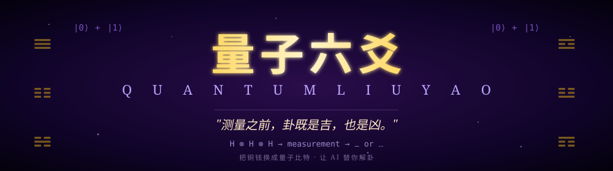
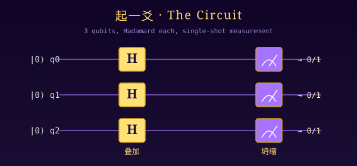
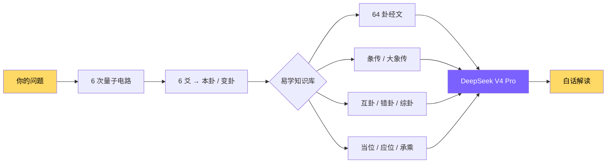

<div align="center">



<br/>

[](https://www.python.org)
[](https://pypi.org/project/pyqpanda3/)
[](https://platform.deepseek.com)
[](LICENSE)
[](#)

**把铜钱换成量子比特  ·  让 AI 替你解卦**

[一分钟跑起来](#一分钟跑起来)  ·  [它在做什么](#它在做什么)  ·  [背后的故事](#背后的故事)  ·  [详细文档](#详细文档)

</div>

---

## ☯ 它在做什么

> 你输入一个问题。
> 量子计算机摇出 6 爻，给你一个本卦和一个变卦。
> AI 拿着 64 卦经文 + 彖传 + 大象传 + 互错综卦 + 当位应承分析，给你一段白话解读。

```
$ python main.py -q "我应该接这个新项目吗？"

⏳ 摇卦中... 量子电路跑了 6 次

═══════════════════════════════════════════════════════
本卦  ䷂ 屯（zhūn）  ←  动爻  ★ 第3爻
变卦  ䷃ 蒙（méng）
═══════════════════════════════════════════════════════

⏳ AI 解卦中...

【一、卦象大意】
屯，下震上坎，雷在水下欲动而被陷。彖传说"刚柔始交而难生，
动乎险中"——你想动的能量是有的，但外部环境处在险境...

【二、动爻指点】
六三动，爻辞"即鹿无虞，惟入于林中，君子几不如舍，往吝"。
白话：追鹿没向导，闯进林子越走越深；明白人懂得见好就收...

【三、变卦趋势】
变卦蒙，山下出泉，象征启蒙未开。提示这件事的下一步...

【四、综合建议】
1. 当前不接，但要把"无虞"两字落实成清单：缺什么人、什么经验...
2. 与对方坦白讲"现在不行、什么条件下可以"...
3. 利用这次机会内观——是钱诱惑还是怕错过？
```

---

## ⚡ 一分钟跑起来

### 一键脚本（推荐）

```bash
git clone https://github.com/yourname/Qliuyao.git
cd Qliuyao
bash setup.sh         # macOS/Linux
# 或 Windows 双击 setup.bat
```

然后：

```bash
conda activate qliuyao
python main.py
```

### 手动版（如果你想知道每一步在干嘛）

```bash
conda create -n qliuyao python=3.11 -y
conda activate qliuyao
pip install -r requirements.txt
python main.py
```

> 📌 项目自带共享 DeepSeek API key，**开箱即用**。
> 想换自己的 key？编辑 `.env`。详见 [关于自带的 API key](#关于自带的-api-key)。

---

## 📖 背后的故事

### 1703 年的圣彼得堡

戈特弗里德·莱布尼茨刚发明二进制几年，激动得停不下来——只用 0 和 1 两个符号居然能表达所有数字。他写信给在中国的法国传教士白晋，分享这个"上帝的算术"。

白晋的回信让他愣了：

> "您来晚了 4000 多年。"

附信附上了一张图：邵雍的"伏羲六十四卦次序图"。

```
☷  000   坤
☶  001   艮
☵  010   坎
☴  011   巽
☳  100   震
☲  101   离
☱  110   兑
☰  111   乾
```

莱布尼茨当场被击中。他后来在《二进制算术的解释》里写：

> "这是我所见过的最完美的二进制系统。中国人在不知道它是二进制的情况下，
>  完美地使用了它三千年。"

<div align="center">

</div>

### 322 年后

二进制有了新的载体——**量子比特**。
莱布尼茨的 0 和 1 不再是写在纸上的笔画，
是 (|0⟩+|1⟩)/√2 这种**叠加态**，
是测量瞬间会"坍缩"成 0 或 1 的物理事件。

这个项目把这个故事画完一整圈：

```
邵雍 (1011)  →  莱布尼茨 (1703)  →  量子比特 (今天)
   阴阳爻        二进制 0/1        |0⟩ + |1⟩
```

### 薛定谔的卦

物理学家说："测量之前，那 3 个量子比特处在 8 种状态的叠加。"
易学家说："天数变化，未起之时，吉凶皆藏。"

**这两句话在数学上是同一句话。**

测量发生的那一瞬间——传统易学叫"动爻"，量子力学叫"波函数坍缩"——一个具体的爻象出现了。然后再来 5 次，凑齐六爻，一卦成形。

这就是这个项目的全部哲学。

---

## 🔬 它怎么运作

<div align="center">

</div>



### 起一爻 = 一次三比特 H 门 + 一次单 shot 测量

每个量子比特经过 Hadamard 门后进入 (|0⟩+|1⟩)/√2 的叠加态，三个比特张量积形成 8 种本征态等概率叠加。单次测量后波函数坍缩到其中一种结果。

把测量结果中 1 的个数映射成爻象：

| 1 的个数 | 爻象 | 阴阳 | 是否变爻 | 概率 |
|---|---|---|---|---|
| 3 | 老阳 ⚊ | 阳 | ✓ 变阴 | 1/8 |
| 2 | 少阴 ⚋ | 阴 |   | 3/8 |
| 1 | 少阳 ⚊ | 阳 |   | 3/8 |
| 0 | 老阴 ⚋ | 阴 | ✓ 变阳 | 1/8 |

跟扔三枚铜钱的传统卦法**分布完全一致**——铜钱用经典力学的随机，我们用量子力学的随机。

---

## ✨ 项目特色

| | |
|---|---|
| 🌌 **真量子电路** | pyqpanda3 三比特 Hadamard 叠加，每爻独立一次电路实例 + 单 shot 测量 |
| 📚 **完整易学知识库** | 64 卦卦辞爻辞 + 64 卦彖传 + 64 卦大象传 + 互错综衍生卦 + 八卦象意 |
| 🤖 **AI 解卦** | DeepSeek V4 Pro，强结构化 prompt，6 步推理强制引用原文 |
| 🔬 **可证伪** | 自带 χ² 卡方检验工具，跑 10000 次给你看分布是不是真符合 1/8 |
| 🎁 **开箱即用** | 自带共享 API key，一行 `python main.py` 就能体验 |
| 📦 **零额外依赖** | AI 模块只用 Python 标准库 urllib，没引入 openai/requests |

---

## 🧪 不信？跑一下卡方检验

```bash
python verify_quantum.py 10000
```

输出节选（实际跑出来的真实数据）：

```
--- 1 次 10000 shots 批量测量分布 ---
  |000⟩  1277  12.77%   (理论 12.50%)  +0.27%
  |001⟩  1241  12.41%   (理论 12.50%)  -0.09%
  |010⟩  1257  12.57%   (理论 12.50%)  +0.07%
  |011⟩  1217  12.17%   (理论 12.50%)  -0.33%
  |100⟩  1300  13.00%   (理论 12.50%)  +0.50%
  |101⟩  1254  12.54%   (理论 12.50%)  +0.04%
  |110⟩  1228  12.28%   (理论 12.50%)  -0.22%
  |111⟩  1226  12.26%   (理论 12.50%)  -0.24%

  卡方统计量 χ² = 4.419   (临界值 χ²₀.₀₅,df=7 = 14.0671)
  ✓ χ² < 14.0671：与均匀分布无显著差异
```

**χ² = 4.419，p ≈ 0.73**——意思是"假设这分布是均匀的，看到这么大或更大偏离的概率有 73%"。说人话：完美。

> ⚠️ 严谨起见：这里用的是 pyqpanda3 的 CPUQVM（量子虚拟机），数学上严格按量子力学计算，但底层熵源仍是 PRNG 伪随机数。要拿"物理真随机"得提交到本源云的悟源超导真机（pyqpanda3 的 `qcloud` 模块）。分布是一样的，区别只在熵源是物理系统 vs PRNG。

---

## 🎯 用法速查

```bash
python main.py                              # 交互式：先问问题，再起卦
python main.py -q "今年适合换工作吗？"      # 直接传问题
python main.py --no-ai                      # 不调 AI，只摇卦看古文
python main.py --classical                  # 不用量子，纯经典随机
python main.py --list-models                # 看 DeepSeek 账号下能用的模型 ID

python verify_quantum.py 10000              # 量子电路统计验证
python check_project.py                     # 项目数学逻辑自检
```

---

## 详细文档

<details>
<summary><b>🗂 项目结构（点击展开）</b></summary>

```
Qliuyao/
├── main.py                 入口：交互流程 + 调度
├── liuyao.py               量子电路 + 起爻逻辑（pyqpanda3）
├── verify_quantum.py       量子电路统计验证（卡方检验）
├── check_project.py        项目数学逻辑自检（端到端）
│
├── hexagrams.py            64 卦数据：卦名/卦辞/爻辞
├── hexagram_wings.py       64 卦的彖传 + 大象传（《十翼》）
├── trigrams.py             八卦象意（天/地/雷/风/水/火/山/泽 + 卦德）
├── gua_analysis.py         互卦/错卦/综卦 + 当位/应位/承乘
│
├── ai_interpreter.py       DeepSeek 解卦（OpenAI 兼容协议，零依赖）
│
├── assets/                 图标和示意图（SVG）
├── setup.sh / setup.bat    一键安装脚本
├── .env                    自带共享 API key
├── .env.example            配置模板
├── .gitignore
├── requirements.txt        仅一行：pyqpanda3>=0.3.5
├── LICENSE                 MIT
└── README.md
```

</details>

<details>
<summary><b>🛠 详细环境配置（点击展开）</b></summary>

#### 你需要

- **Python 3.10 – 3.14**（推荐 3.11）
- **macOS 13+ (Apple Silicon) / Windows / Linux x86_64**
  - ⚠️ Intel Mac 暂不支持，pyqpanda3 没发 x86 macOS wheel
  - ⚠️ macOS 必须 ≥ 13.0 (Ventura)

#### 装 Miniconda（如果还没装）

**macOS (Apple Silicon)**:
```bash
mkdir -p ~/miniconda3
curl https://repo.anaconda.com/miniconda/Miniconda3-latest-MacOSX-arm64.sh -o ~/miniconda3/miniconda.sh
bash ~/miniconda3/miniconda.sh -b -u -p ~/miniconda3
rm ~/miniconda3/miniconda.sh
~/miniconda3/bin/conda init zsh    # 用 zsh 就这条
~/miniconda3/bin/conda init bash   # 用 bash 就这条
```

**Windows**:
去 https://docs.conda.io/projects/miniconda/en/latest/ 下载安装，记得勾选 "Add Miniconda3 to my PATH"。

**Linux**:
```bash
mkdir -p ~/miniconda3
wget https://repo.anaconda.com/miniconda/Miniconda3-latest-Linux-x86_64.sh -O ~/miniconda3/miniconda.sh
bash ~/miniconda3/miniconda.sh -b -u -p ~/miniconda3
rm ~/miniconda3/miniconda.sh
~/miniconda3/bin/conda init bash
```

装完关掉终端再开，运行 `conda --version` 应该能看到版本号。

#### 创建环境 + 装依赖

```bash
conda create -n qliuyao python=3.11 -y
conda activate qliuyao         # 之后每次开新终端都要先做这步！
cd /到你/Qliuyao
pip install -r requirements.txt
```

激活后终端提示符会从 `(base)` 变成 `(qliuyao)`。

#### 验证安装

```bash
python -c "import pyqpanda3.core; print('OK')"
python check_project.py
python verify_quantum.py 1000
```

#### PyCharm 配置

`Open` 选 `Qliuyao` 文件夹 → `Settings → Project → Python Interpreter → Add Local Interpreter → Conda → Existing → 选 qliuyao`。

之后右键 `main.py → Run 'main'` 即可。如果想交互输入问题，要在 Run Configuration 勾选 "Emulate terminal in output console"。

</details>

<details>
<summary><b>🤖 AI 解卦的 prompt 设计（点击展开）</b></summary>

老版 prompt 只塞了卦辞 + 爻辞，AI 容易出泛泛而谈的"勉之、慎之、亨通"八股。
新版把以下知识全部喂进 prompt：

| 知识层 | 内容 |
|---|---|
| 八卦象意 | 天/地/雷/风/水/火/山/泽 + 卦德 + 家庭/人体/动物对应 |
| 上下卦组合 | "水雷屯"、"地水师"——卦象之根 |
| **彖传** | 64 卦每卦一段，《十翼》中最权威的官方注释 |
| **大象传** | 64 卦每卦一句"君子以X"——儒家修养格言 |
| **爻位结构** | 当位 / 中位 / 中正 / 应位 / 承乘 |
| **互卦/错卦/综卦** | 衍生卦——内部结构 / 对立面 / 换视角 |
| **朱子断卦法** | 根据动爻数自动判定看本卦还是变卦 |
| **Few-shot 示例** | 一个完整范例答案 |

强制结构化推理：模型必须先做 `<推理>` 段，按 **辨象 → 取辞 → 观结构 → 看动向 → 参互错综 → 综合** 6 步演算，**每一步都要直接引用具体卦辞/爻辞/彖传作为依据**。

明确禁止：

- 不预测具体事件、时间、人名、数字
- 不绝对化吉凶（"必然"、"一定"全禁）
- 卦象与所问关联弱时必须诚实承认
- 古文必须配现代白话翻译
- 综合建议必须给 2–3 条具体可操作方向，不许"听天命"这种空话

</details>

<details>
<summary><b>🐛 常见问题排错（点击展开）</b></summary>

**`pip install pyqpanda3` 报 `Could not find a version that satisfies`**
- Python 版本不在 3.10–3.14 范围
- macOS 是 Intel 芯片（pyqpanda3 暂未发 x86 macOS wheel）
- macOS < 13.0

**AI 解卦报 HTTP 401**
- API key 不对或额度耗尽。自己注册新 key 后改 `.env`：https://platform.deepseek.com

**AI 解卦报 HTTP 400 / model not found**
- 模型 ID 跟实际不一致。`python main.py --list-models` 看一下，把准确名字写到 `.env` 的 `LLM_MODEL=...`

**`command not found: python`**
- 没激活环境。`conda activate qliuyao` 一下，看终端提示符变成 `(qliuyao)` 就对了

</details>

<details>
<summary><b>🎁 关于自带的 API key（点击展开）</b></summary>

`.env` 里的 DeepSeek API key 是项目作者主动共享的，你**直接拿来用**就行，不需要自己注册。

但要注意：

- 共享 key 的额度是**所有使用者共用**的，烧完就没了
- 共享 key 任何时候可能被作废或更换
- 长期使用建议自己注册：https://platform.deepseek.com （免费注册，新用户有 1 元体验额度，够算 1000 卦）

要换成自己的 key，编辑 `.env`：

```
DEEPSEEK_API_KEY=sk-换成你自己的
```

想换其他 OpenAI 兼容服务（Kimi / 通义 / 本地 Ollama）：

```
LLM_BASE_URL=https://你的服务.com/v1
LLM_MODEL=你的模型名
DEEPSEEK_API_KEY=你的 key  # 变量名保留
```

</details>

---

## 🧭 Roadmap

- [ ] **接真机**：pyqpanda3 的 `qcloud` 子模块支持把电路提交到本源云的悟源超导真机
- [ ] **录小象传**：现在有彖传 + 大象传，没录每爻的小象（64 × 6 = 384 条）
- [ ] **流式 AI**：改 SSE 流式输出，体验接近 ChatGPT
- [ ] **Web 版**：套个 Streamlit/Gradio 做网页摇卦器
- [ ] **可视化**：matplotlib 直方图展示分布
- [ ] **历史记录**：把每次起卦存成 SQLite，做"我的卦签集"

---

## 🙏 致敬与说明

- **《周易》** —— 公元前 11 世纪左右成书。本项目使用通行本经文，含卦辞、爻辞、彖传、大象传，公共领域。
- **邵雍** (1011–1077) —— "伏羲六十四卦次序图"作者，为二进制 8 卦排序奠定基础。
- **戈特弗里德·莱布尼茨** (1646–1716) —— 二进制发明人。1703 年读到邵雍图后写下《二进制算术的解释》。
- **本源量子（OriginQ）** —— pyqpanda3 SDK 提供方。中国本土量子计算公司。
- **DeepSeek** —— 提供 V4 Pro 大模型 API。
- **朱熹《周易本义》** —— 主要参考的经学注本，断卦法采用其《易学启蒙·考变占法》规则。

---

## 📜 License

[MIT](LICENSE)

---

<div align="center">

**这是一个趣味与文化项目。**

量子模拟器是真实量子力学分布、PRNG 熵源；只有提交到真机才是物理真随机。
"卦象准不准"是另一码事——AI 解卦给的是基于卦辞文本的合理引申，不是先知预言。

**请勿用于重大决策。**

把它当成：一个量子计算和易学的跨界小实验、一个每日一签式的反思工具、一个让你接触《周易》原典文本的入口——就够了。

<br/>

> *"卦在被观测之前，是叠加的；
> 被观测之后，是已经发生的。
> 中间的一刻，叫做'动'。"*

<sub>— 这个项目想说的话</sub>

</div>
